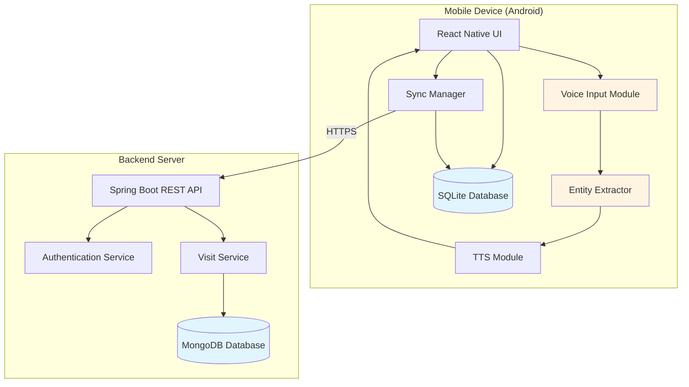
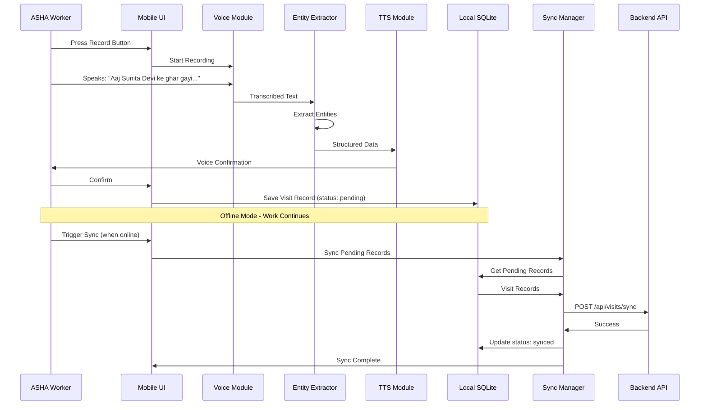

# Design Document: Sahayak-Voice Mobile

## Overview

Sahayak-Voice Mobile is a voice-first, offline-first mobile health application designed to solve India's "Last Mile" problem in public health service delivery. The system consists of three main components:

1. **React Native Mobile Application (Android)**: Voice-driven UI for ASHA workers to record home visit data
2. **Spring Boot Backend (Java)**: REST API server for authentication and data persistence
3. **MongoDB Database**: Central storage for synced health records

The architecture prioritizes offline functionality, low cognitive load, and minimal typing. The mobile app captures spoken narratives, extracts structured data using lightweight NLP, provides voice confirmation, stores records locally, and syncs to the backend when connectivity is available.

### Key Design Principles

- **Offline-First**: All core functionality works without internet connectivity
- **Voice-First**: Primary interaction through speech, minimal typing
- **Low Cognitive Load**: Icon-based UI, simple navigation, clear feedback
- **Lightweight AI**: On-device or simple pattern-based entity extraction, no heavy cloud APIs
- **Privacy-Friendly**: No sensitive data sent to third-party AI services
- **Incremental Sync**: Data syncs opportunistically when network is available

## Architecture

### System Architecture Diagram



### Component Interaction Flow



### Technology Stack

**Mobile Application:**
- Framework: React Native (Android-focused)
- Voice Input: react-native-voice or @react-native-voice/voice
- TTS: react-native-tts
- Local Storage: react-native-sqlite-storage or Expo SQLite
- Navigation: React Navigation
- State Management: React Context API or Redux (lightweight)
- Network Detection: @react-native-community/netinfo

**Backend:**
- Framework: Spring Boot 3.x (Java 17+)
- Web: Spring Web (REST Controllers)
- Security: Spring Security with JWT
- Database: Spring Data MongoDB
- Build Tool: Maven or Gradle

**Database:**
- Backend: MongoDB 6.x+
- Mobile: SQLite 3.x

## Components and Interfaces

### Mobile Application Components

#### 1. Voice Input Module

**Responsibilities:**
- Capture audio input from device microphone
- Convert speech to text using on-device or cloud-based speech recognition
- Support Hindi and English languages
- Handle recording state (start, stop, cancel)

**Interface:**
```typescript
interface VoiceInputModule {
  startRecording(): Promise<void>;
  stopRecording(): Promise<string>; // Returns transcribed text
  cancelRecording(): void;
  isRecording(): boolean;
  getSupportedLanguages(): string[];
}
```

**Implementation Notes:**
- Use react-native-voice library
- Configure for 'hi-IN' (Hindi) and 'en-IN' (English) locales
- Handle permissions for microphone access
- Provide visual feedback during recording
- Handle errors gracefully (no microphone, permission denied)

#### 2. Entity Extractor

**Responsibilities:**
- Parse transcribed text to extract structured health data
- Identify patient names, blood pressure readings, symptoms, dates
- Use lightweight pattern matching and keyword detection
- No dependency on cloud-based LLM APIs

**Interface:**
```typescript
interface EntityExtractor {
  extractEntities(text: string, language: 'hi' | 'en'): VisitRecord;
}

interface VisitRecord {
  patientName: string | null;
  bloodPressure: string | null; // Format: "X/Y"
  childSymptom: string | null;
  visitDate: string; // ISO date string
  createdAt: string; // ISO timestamp
  syncStatus: 'pending' | 'synced';
}
```

**Extraction Logic:**

1. **Patient Name Extraction:**
   - Hindi patterns: Look for names after "ke ghar", "ki", "ka"
   - English patterns: Look for capitalized names at sentence start
   - Regex: `/([A-Z][a-z]+ (?:Devi|Kumar|Singh|Sharma|[A-Z][a-z]+))/g`

2. **Blood Pressure Extraction:**
   - Pattern: `\d{2,3}[/\\]\d{2,3}` (e.g., "140/90", "120\\80")
   - Keywords: "BP", "blood pressure", "रक्तचाप"

3. **Child Symptom Extraction:**
   - Keywords: "bukhar" (fever), "khansi" (cough), "dast" (diarrhea), "ulti" (vomiting)
   - English: "fever", "cough", "cold", "diarrhea", "vomiting"
   - Context: Look for symptoms after "bacche" (child), "baby", "child"

4. **Date Extraction:**
   - Keywords: "aaj" (today), "kal" (yesterday), "today", "yesterday"
   - Default to current date if not specified

**Implementation Strategy:**
```typescript
class SimpleEntityExtractor implements EntityExtractor {
  private readonly patterns = {
    bloodPressure: /\b(\d{2,3})[\/\\](\d{2,3})\b/,
    hindiName: /(\w+\s+(?:Devi|Kumar|Singh|Sharma))/i,
    englishName: /\b([A-Z][a-z]+\s+[A-Z][a-z]+)\b/,
  };
  
  private readonly symptoms = {
    hi: ['bukhar', 'khansi', 'dast', 'ulti', 'thand'],
    en: ['fever', 'cough', 'diarrhea', 'vomiting', 'cold']
  };
  
  extractEntities(text: string, language: 'hi' | 'en'): VisitRecord {
    // Implementation details in code
  }
}
```

#### 3. TTS Module

**Responsibilities:**
- Convert structured visit data back to spoken confirmation
- Prompt for missing required fields
- Support Hindi and English output

**Interface:**
```typescript
interface TTSModule {
  speakConfirmation(record: VisitRecord, language: 'hi' | 'en'): Promise<void>;
  speakPrompt(missingFields: string[], language: 'hi' | 'en'): Promise<void>;
  stop(): void;
}
```

**Confirmation Templates:**

Hindi:
```
"{patientName} ka BP {bloodPressure} record kiya gaya. Bacche ko {childSymptom} hai."
```

English:
```
"Recorded {patientName}'s BP as {bloodPressure}. Child has {childSymptom}."
```

Missing Field Prompts:
```
Hindi: "Kya bacche ka wajan naap liya?"
English: "Did you measure the child's weight?"
```

#### 4. Local Database (SQLite)

**Schema:**

```sql
CREATE TABLE visits (
  id INTEGER PRIMARY KEY AUTOINCREMENT,
  patient_name TEXT,
  blood_pressure TEXT,
  child_symptom TEXT,
  visit_date TEXT NOT NULL,
  created_at TEXT NOT NULL,
  sync_status TEXT NOT NULL DEFAULT 'pending',
  user_id TEXT NOT NULL
);

CREATE INDEX idx_sync_status ON visits(sync_status);
CREATE INDEX idx_user_id ON visits(user_id);
```

**Interface:**
```typescript
interface LocalDatabase {
  saveVisit(record: VisitRecord): Promise<number>; // Returns record ID
  getPendingVisits(): Promise<VisitRecord[]>;
  getAllVisits(): Promise<VisitRecord[]>;
  updateSyncStatus(id: number, status: 'synced'): Promise<void>;
  deleteVisit(id: number): Promise<void>;
}
```

#### 5. Sync Manager

**Responsibilities:**
- Detect network connectivity
- Batch sync pending records to backend
- Handle sync failures and retries
- Update local sync status

**Interface:**
```typescript
interface SyncManager {
  checkConnectivity(): Promise<boolean>;
  syncPendingRecords(): Promise<SyncResult>;
  getSyncStatus(): SyncStatus;
}

interface SyncResult {
  totalRecords: number;
  syncedRecords: number;
  failedRecords: number;
  errors: string[];
}

interface SyncStatus {
  lastSyncTime: string | null;
  pendingCount: number;
  isOnline: boolean;
}
```

**Sync Algorithm:**
```typescript
async syncPendingRecords(): Promise<SyncResult> {
  1. Check network connectivity
  2. If offline, return early with error
  3. Get all pending records from LocalDatabase
  4. For each record:
     a. Send POST request to /api/visits/sync
     b. If success: Update local sync_status to 'synced'
     c. If failure: Log error, continue to next record
  5. Return sync results summary
}
```

#### 6. UI Screens

**Login Screen:**
- Phone number input field
- Password input field
- Login button
- Error message display area

**Home Screen:**
- Large circular "Record Visit" button (microphone icon)
- Sync status indicator (online/offline, pending count)
- Navigation to "View Records" screen
- Logout button

**Voice Recording Screen:**
- Animated microphone icon (pulsing during recording)
- "Recording..." text
- Stop button
- Cancel button
- Transcribed text display (real-time or after stop)

**Voice Confirmation Screen:**
- Extracted data display:
  - Patient Name
  - Blood Pressure
  - Child Symptom
  - Visit Date
- Play confirmation button (TTS)
- Confirm button (saves record)
- Re-record button (goes back to recording)

**Offline Records List Screen:**
- List of all visit records
- Each item shows:
  - Patient name
  - Visit date
  - Sync status icon (pending/synced)
- Pull-to-refresh
- Manual sync button (when online)

**Sync Status Screen:**
- Last sync time
- Pending records count
- Synced records count
- Sync progress indicator
- Manual sync trigger button

### Backend Components

#### 1. Authentication Service

**Responsibilities:**
- Validate user credentials
- Generate JWT tokens
- Manage user sessions

**Interface:**
```java
public interface AuthenticationService {
    AuthResponse login(LoginRequest request);
    boolean validateToken(String token);
    String getUserIdFromToken(String token);
}

public class LoginRequest {
    private String phoneNumber;
    private String password;
}

public class AuthResponse {
    private String token;
    private String userId;
    private String name;
}
```

**Implementation Notes:**
- Use BCrypt for password hashing
- JWT tokens expire after 7 days (long-lived for offline scenarios)
- Include userId in JWT claims

#### 2. Visit Service

**Responsibilities:**
- Store visit records in MongoDB
- Retrieve visit history for users
- Validate visit data

**Interface:**
```java
public interface VisitService {
    VisitRecord saveVisit(VisitRecord record, String userId);
    List<VisitRecord> getVisitsByUser(String userId);
    VisitRecord getVisitById(String visitId);
}

public class VisitRecord {
    private String id;
    private String userId;
    private String patientName;
    private String bloodPressure;
    private String childSymptom;
    private LocalDate visitDate;
    private LocalDateTime createdAt;
}
```

#### 3. REST API Controllers

**Authentication Controller:**
```java
@RestController
@RequestMapping("/api/auth")
public class AuthController {
    
    @PostMapping("/login")
    public ResponseEntity<AuthResponse> login(@RequestBody LoginRequest request) {
        // Validate credentials and return JWT token
    }
}
```

**Visit Controller:**
```java
@RestController
@RequestMapping("/api/visits")
public class VisitController {
    
    @PostMapping("/sync")
    public ResponseEntity<VisitRecord> syncVisit(
        @RequestHeader("Authorization") String token,
        @RequestBody VisitRecord record
    ) {
        // Validate token, save visit, return saved record
    }
    
    @GetMapping
    public ResponseEntity<List<VisitRecord>> getVisits(
        @RequestHeader("Authorization") String token
    ) {
        // Validate token, return user's visits
    }
}
```

## Data Models

### Mobile Application Models

**VisitRecord (TypeScript):**
```typescript
interface VisitRecord {
  id?: number; // Local database ID
  patientName: string | null;
  bloodPressure: string | null;
  childSymptom: string | null;
  visitDate: string; // ISO date string
  createdAt: string; // ISO timestamp
  syncStatus: 'pending' | 'synced';
  userId: string;
}
```

**User (TypeScript):**
```typescript
interface User {
  id: string;
  name: string;
  phoneNumber: string;
  token: string;
}
```

### Backend Models

**User (Java/MongoDB):**
```java
@Document(collection = "users")
public class User {
    @Id
    private String id;
    
    private String name;
    
    @Indexed(unique = true)
    private String phoneNumber;
    
    private String hashedPassword;
    
    private LocalDateTime createdAt;
}
```

**VisitRecord (Java/MongoDB):**
```java
@Document(collection = "visits")
public class VisitRecord {
    @Id
    private String id;
    
    @Indexed
    private String userId;
    
    private String patientName;
    private String bloodPressure;
    private String childSymptom;
    
    private LocalDate visitDate;
    
    @Indexed
    private LocalDateTime createdAt;
}
```

### MongoDB Collections

**users collection:**
```json
{
  "_id": "ObjectId",
  "name": "Priya Sharma",
  "phoneNumber": "9876543210",
  "hashedPassword": "$2a$10$...",
  "createdAt": "2024-01-15T10:30:00Z"
}
```

**visits collection:**
```json
{
  "_id": "ObjectId",
  "userId": "user_id_reference",
  "patientName": "Sunita Devi",
  "bloodPressure": "140/90",
  "childSymptom": "Fever",
  "visitDate": "2024-01-20",
  "createdAt": "2024-01-20T14:30:00Z"
}
```

### SQLite Schema (Mobile)

```sql
-- visits table
CREATE TABLE visits (
  id INTEGER PRIMARY KEY AUTOINCREMENT,
  patient_name TEXT,
  blood_pressure TEXT,
  child_symptom TEXT,
  visit_date TEXT NOT NULL,
  created_at TEXT NOT NULL,
  sync_status TEXT NOT NULL DEFAULT 'pending',
  user_id TEXT NOT NULL
);

CREATE INDEX idx_sync_status ON visits(sync_status);
CREATE INDEX idx_user_id ON visits(user_id);
CREATE INDEX idx_visit_date ON visits(visit_date);

-- user_session table (stores logged-in user)
CREATE TABLE user_session (
  id INTEGER PRIMARY KEY CHECK (id = 1),
  user_id TEXT NOT NULL,
  name TEXT NOT NULL,
  phone_number TEXT NOT NULL,
  token TEXT NOT NULL,
  logged_in_at TEXT NOT NULL
);
```


## Correctness Properties

*A property is a characteristic or behavior that should hold true across all valid executions of a system—essentially, a formal statement about what the system should do. Properties serve as the bridge between human-readable specifications and machine-verifiable correctness guarantees.*

### Authentication Properties

**Property 1: Successful authentication provides access token**

*For any* valid user credentials, when authentication succeeds, the system should return an authentication token and store it locally for subsequent API requests.

**Validates: Requirements 1.1, 1.4, 1.5**

**Property 2: Invalid credentials are rejected**

*For any* invalid user credentials, the authentication system should reject the login attempt and display an error message without granting access.

**Validates: Requirements 1.2**

**Property 3: Password storage security**

*For any* user password, the stored value in the database should be hashed and should not match the plaintext input.

**Validates: Requirements 1.3**

### Entity Extraction Properties

**Property 4: Patient name extraction**

*For any* transcribed text containing a patient name in the expected format (e.g., "Sunita Devi", "Raj Kumar"), the Entity_Extractor should correctly identify and extract the patient name.

**Validates: Requirements 3.1**

**Property 5: Blood pressure extraction**

*For any* transcribed text containing a blood pressure reading in the format "X/Y" (where X and Y are 2-3 digit numbers), the Entity_Extractor should correctly extract the blood pressure value.

**Validates: Requirements 3.2**

**Property 6: Child symptom extraction**

*For any* transcribed text containing known symptom keywords (bukhar, khansi, fever, cough, etc.), the Entity_Extractor should correctly identify and extract the child symptom.

**Validates: Requirements 3.3**

**Property 7: Visit date extraction**

*For any* transcribed text containing date references (aaj, kal, today, yesterday), the Entity_Extractor should correctly extract and convert the date to ISO format.

**Validates: Requirements 3.4**

**Property 8: Structured output generation**

*For any* transcribed text input, the Entity_Extractor should produce a valid VisitRecord object with all required fields (patientName, bloodPressure, childSymptom, visitDate, createdAt, syncStatus).

**Validates: Requirements 3.6**

### Voice Confirmation Properties

**Property 9: TTS confirmation includes all extracted fields**

*For any* VisitRecord with non-null fields, the TTS confirmation text should include the patient name, blood pressure, and child symptom values.

**Validates: Requirements 4.2**

**Property 10: Missing field prompts**

*For any* VisitRecord with null or missing required fields, the TTS module should generate a prompt asking for the missing information.

**Validates: Requirements 4.3**

**Property 11: Confirmation saves to local database**

*For any* VisitRecord that is confirmed by the user, the record should be immediately saved to the Local_Database with all fields intact.

**Validates: Requirements 4.4**

### Local Storage Properties

**Property 12: Immediate persistence**

*For any* confirmed VisitRecord, the record should be stored in the Local_Database immediately upon confirmation.

**Validates: Requirements 5.1**

**Property 13: Local storage round-trip**

*For any* VisitRecord saved to the Local_Database, retrieving the record should return an equivalent object with all fields (patientName, bloodPressure, childSymptom, visitDate, createdAt) preserved.

**Validates: Requirements 5.2**

**Property 14: Initial sync status**

*For any* newly stored VisitRecord, the syncStatus field should be set to "pending" by default.

**Validates: Requirements 5.3**

**Property 15: Complete record retrieval**

*For any* set of VisitRecords stored in the Local_Database, querying all records should return every stored record without omission.

**Validates: Requirements 5.5**

### Synchronization Properties

**Property 16: Pending records selection**

*For any* Local_Database containing VisitRecords with mixed sync statuses, the Sync_Manager should retrieve only records with syncStatus "pending" when preparing to sync.

**Validates: Requirements 6.2**

**Property 17: Sync transmission**

*For any* pending VisitRecord, when sync is triggered, the Sync_Manager should send the record to the Backend_System via POST /api/visits/sync.

**Validates: Requirements 6.3**

**Property 18: Successful sync status update**

*For any* VisitRecord that is successfully synced to the backend, the local syncStatus should be updated from "pending" to "synced".

**Validates: Requirements 6.4**

**Property 19: Failed sync status preservation**

*For any* VisitRecord where sync fails, the syncStatus should remain "pending" and an error message should be displayed.

**Validates: Requirements 6.5**

**Property 20: Sync status visibility**

*For any* VisitRecord displayed in the offline records list, the UI should show the current syncStatus (pending or synced).

**Validates: Requirements 6.6**

### Backend Persistence Properties

**Property 21: Authentication token validation**

*For any* request to POST /api/visits/sync, the Backend_System should validate the authentication token before processing the request.

**Validates: Requirements 7.1**

**Property 22: Valid record persistence**

*For any* valid VisitRecord received by the Backend_System, the record should be stored in the MongoDB_Database.

**Validates: Requirements 7.2**

**Property 23: MongoDB storage round-trip**

*For any* VisitRecord saved to MongoDB, retrieving the record should return an equivalent object with all fields preserved.

**Validates: Requirements 7.3**

**Property 24: Success response on storage**

*For any* VisitRecord successfully stored in MongoDB, the Backend_System should return a success response (HTTP 200/201) to the Mobile_App.

**Validates: Requirements 7.4**

**Property 25: User-specific visit retrieval**

*For any* user with stored VisitRecords in MongoDB, querying GET /api/visits with that user's token should return all and only that user's visit records.

**Validates: Requirements 7.5**

## Error Handling

### Mobile Application Error Handling

**Voice Input Errors:**
- **Microphone Permission Denied**: Display clear message asking user to grant microphone permission in settings
- **Speech Recognition Unavailable**: Show error message and suggest checking device settings or internet connectivity
- **Recording Timeout**: Automatically stop recording after 2 minutes and process available audio
- **No Speech Detected**: Prompt user to speak louder or try again

**Entity Extraction Errors:**
- **No Entities Extracted**: Prompt user with TTS asking for specific information (e.g., "Kya patient ka naam batayein?")
- **Partial Extraction**: Accept partial data and prompt for missing fields via TTS
- **Ambiguous Data**: Use first match found, allow user to re-record if incorrect

**Local Storage Errors:**
- **Database Write Failure**: Retry up to 3 times, then show error message and keep data in memory
- **Database Full**: Alert user to free up device storage
- **Corrupted Database**: Attempt recovery, fallback to creating new database (data loss warning)

**Sync Errors:**
- **Network Unavailable**: Disable sync button, show offline indicator
- **Backend Unreachable**: Retry with exponential backoff (1s, 2s, 4s), then fail gracefully
- **Authentication Expired**: Redirect to login screen with session expired message
- **Sync Conflict**: Backend record newer than local - keep backend version (last-write-wins)
- **Partial Sync Failure**: Continue syncing remaining records, report which records failed

### Backend Error Handling

**Authentication Errors:**
- **Invalid Credentials**: Return HTTP 401 with error message
- **Expired Token**: Return HTTP 401 with "token expired" message
- **Malformed Token**: Return HTTP 400 with "invalid token format" message

**Validation Errors:**
- **Missing Required Fields**: Return HTTP 400 with list of missing fields
- **Invalid Data Format**: Return HTTP 400 with specific validation error
- **Duplicate Record**: Accept and store (no uniqueness constraint on visits)

**Database Errors:**
- **MongoDB Connection Failure**: Return HTTP 503 with "service unavailable" message
- **Write Failure**: Retry up to 3 times, then return HTTP 500
- **Query Timeout**: Return HTTP 504 with timeout message

**General Errors:**
- **Unhandled Exceptions**: Log error details, return HTTP 500 with generic error message
- **Rate Limiting**: Return HTTP 429 if too many requests from same user

### Error Recovery Strategies

**Offline-First Resilience:**
- All mobile operations work offline by default
- Sync is opportunistic, not required for core functionality
- Failed syncs are retried on next sync attempt
- No data loss even if sync never succeeds

**Graceful Degradation:**
- If TTS fails, show text confirmation instead
- If voice input fails, provide text input fallback (future enhancement)
- If entity extraction fails, allow manual form entry (future enhancement)

**User Feedback:**
- All errors shown in simple, non-technical language
- Hindi and English error messages
- Visual indicators (icons, colors) for error states
- Clear action items for user to resolve errors

## Testing Strategy

### Dual Testing Approach

This project requires both unit testing and property-based testing to ensure comprehensive coverage:

- **Unit Tests**: Verify specific examples, edge cases, error conditions, and integration points between components
- **Property Tests**: Verify universal properties across all inputs through randomized testing

Both approaches are complementary and necessary. Unit tests catch concrete bugs in specific scenarios, while property tests verify general correctness across a wide range of inputs.

### Property-Based Testing Configuration

**Library Selection:**
- **Mobile (TypeScript/JavaScript)**: Use `fast-check` library for property-based testing
- **Backend (Java)**: Use `jqwik` library for property-based testing

**Test Configuration:**
- Each property test must run minimum 100 iterations (due to randomization)
- Each test must reference its design document property in a comment
- Tag format: `// Feature: sahayak-voice-mobile, Property {number}: {property_text}`

**Property Test Implementation:**
- Each correctness property listed above must be implemented as a single property-based test
- Tests should generate random valid inputs and verify the property holds
- Tests should include edge cases in the random generation (empty strings, null values, boundary values)

### Unit Testing Strategy

**Mobile Application Unit Tests:**

1. **Voice Input Module**:
   - Test recording state transitions (idle → recording → stopped)
   - Test permission handling
   - Test error scenarios (no microphone, permission denied)
   - Mock react-native-voice library

2. **Entity Extractor**:
   - Test specific extraction examples (Hindi and English)
   - Test edge cases (no entities, multiple entities, malformed input)
   - Test each regex pattern independently
   - Test date parsing logic

3. **TTS Module**:
   - Test confirmation text generation
   - Test missing field prompts
   - Test language switching
   - Mock react-native-tts library

4. **Local Database**:
   - Test CRUD operations
   - Test query filtering (by sync status, by user)
   - Test database initialization
   - Test migration scenarios

5. **Sync Manager**:
   - Test connectivity detection
   - Test batch sync logic
   - Test retry mechanism
   - Test status updates
   - Mock network requests

6. **UI Components**:
   - Test screen rendering
   - Test navigation flows
   - Test user interactions
   - Test error display
   - Use React Native Testing Library

**Backend Unit Tests:**

1. **Authentication Service**:
   - Test login with valid credentials
   - Test login with invalid credentials
   - Test token generation
   - Test token validation
   - Test password hashing

2. **Visit Service**:
   - Test visit creation
   - Test visit retrieval by user
   - Test visit retrieval by ID
   - Test validation logic

3. **REST Controllers**:
   - Test endpoint routing
   - Test request/response mapping
   - Test authentication middleware
   - Test error responses
   - Use Spring Boot Test framework

4. **MongoDB Integration**:
   - Test repository operations
   - Test query methods
   - Test indexing
   - Use embedded MongoDB for tests

### Integration Testing

**Mobile Integration Tests:**
- Test complete voice recording → extraction → confirmation → storage flow
- Test sync flow with mocked backend
- Test offline → online transition
- Test authentication → home screen flow

**Backend Integration Tests:**
- Test complete API flows (login → sync → retrieve)
- Test with real MongoDB instance (test container)
- Test authentication across multiple endpoints
- Test concurrent sync requests

### End-to-End Testing

**Manual Testing Scenarios:**
1. Complete home visit recording in Hindi
2. Complete home visit recording in English
3. Recording with missing fields
4. Offline recording and later sync
5. Multiple recordings and batch sync
6. Login and logout flow
7. Network interruption during sync

**Automated E2E Tests (Optional):**
- Use Detox for React Native E2E testing
- Test critical user journeys
- Run on Android emulator

### Test Coverage Goals

- **Unit Test Coverage**: Minimum 80% code coverage for both mobile and backend
- **Property Test Coverage**: All 25 correctness properties must have corresponding property tests
- **Integration Test Coverage**: All major component interactions tested
- **E2E Test Coverage**: All critical user journeys tested manually

### Testing Tools Summary

**Mobile:**
- Jest (unit testing framework)
- React Native Testing Library (component testing)
- fast-check (property-based testing)
- Detox (E2E testing, optional)

**Backend:**
- JUnit 5 (unit testing framework)
- Spring Boot Test (integration testing)
- jqwik (property-based testing)
- Testcontainers (MongoDB testing)
- MockMvc (API testing)

### Continuous Testing

- Run unit tests on every commit
- Run property tests on every pull request
- Run integration tests before deployment
- Run E2E tests on release candidates
- Monitor test execution time and optimize slow tests

